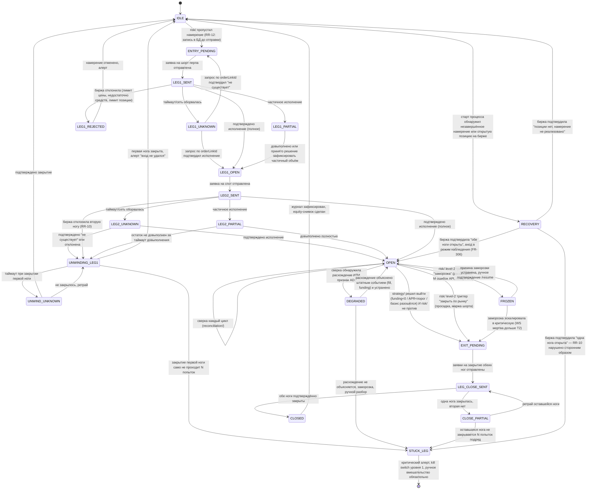

# ARCHITECTURE — модули, схема БД, машина состояний позиции

Версия 1.0 · Фаза 0 · входные документы: [SRS.md](SRS.md), [DECISIONS.md](DECISIONS.md), [PARAMS-CONSERVATIVE.md](PARAMS-CONSERVATIVE.md)

Этот документ закрывает exit criterion Фазы 0: диаграмма состояний позиции нарисована, для каждого перехода описан сценарий отказа и путь восстановления.

---

## 1. Процессы

Один логический бот — это не один OS-процесс. RR-31 требует, чтобы kill switch уровня 1 работал, даже если основной цикл завис — значит он не может жить в основном цикле.

```
┌─────────────────┐     БД      ┌──────────────────┐
│  trader          │◄───────────►│  killswitch-      │
│  (основной цикл) │             │  listener          │
│                  │             │  (Telegram + файл- │
│  market-data     │             │   флаг, отдельный  │
│  strategy        │             │   systemd unit)    │
│  risk            │             └──────────┬────────┘
│  execution       │                        │ пишет command
│  reconciliation  │                        │ читает heartbeat
└────────┬─────────┘                        │
         │ heartbeat раз в минуту            │
         ▼                                   ▼
┌──────────────────┐              (свои ключи Bybit:
│  watchdog          │              Trade+Read, для
│  (внешний хост,     │              принудительного
│  НЕ этот VPS)       │              закрытия, если
│  RR-35, RR-37       │              trader не ACK'ит
└──────────────────┘              команду за N секунд)
```

**trader** — основной цикл: сбор данных → стратегия → риск-вето → исполнение → сверка. Единственный процесс, который открывает и закрывает позиции в штатном режиме.

**killswitch-listener** — отдельный OS-процесс (systemd unit, `Restart=always`). Слушает Telegram и файл-флаг. Не содержит бизнес-логики стратегии. Имеет собственный доступ к Bybit (тот же ключ, права Trade+Read) — это осознанное решение: если это свойство не выполнено, RR-37 (супервизор закрывает позиции, если trader не подтвердил за N секунд) физически нереализуемо, потому что supervisor не сможет отправить ордер на закрытие без доступа к бирже.

**watchdog** — на **другом** хосте (RR-35 требует независимости отказов). Получает heartbeat, при отсутствии дольше 5 минут шлёт алерт через отдельный Telegram-бот с отдельным токеном (RR-36). Не имеет доступа к Bybit — это чистый наблюдатель, а не исполнитель. Исполнитель последней инстанции — killswitch-listener на основном VPS, потому что у него есть ключ; watchdog просто гарантирует, что человек узнает, если и trader, и killswitch-listener замолчали одновременно (то есть упал весь VPS).

Разделение trader / killswitch-listener решает конкретный сценарий из RR-31: цикл завис на `await` без таймаута (классическая причина — забытый таймаут на сокете). `trader` не реагирует ни на что. `killswitch-listener` — отдельный процесс с отдельным event loop — продолжает получать команды и, не дождавшись подтверждения от `trader` за N секунд, закрывает позиции сам.

---

## 2. Модули (`trader`)

```
config/          конфигурация, схема-валидация при старте (zod), отказ стартовать при OPEN-параметре без значения
exchange/        единственная точка входа в bybit-api. Нормализация ошибок, throwExceptions+retCode-проверка,
                 rate limiter, backoff с джиттером и потолком, таймауты, схема-валидация WS-сообщений
market-data/     приём и запись funding/цен/OI/long-short/ликвидаций, снимки стакана
strategy/        чистые функции: вход данные → решение. Без побочных эффектов, без доступа к execution/
risk/            все проверки перед действием, право вето. Единственный модуль, который может сказать «нет»
execution/       открытие/закрытие пар, идемпотентность, откат при отказе ноги, журнал намерений
reconciliation/  периодическая сверка локального состояния с биржей, обнаружение ADL
killswitch/      общая логика уровней (используется и trader, и killswitch-listener), не сам процесс
storage/         Kysely-клиент, миграции, репозитории по агрегатам
notify/          Telegram: алерты, суточная сводка
watchdog/        код heartbeat-клиента внутри trader; сам watchdog-процесс — отдельный деплой (см. §1)
```

**Контракт `strategy/` → `risk/` → `execution/`:** `strategy/` возвращает намерение (`OpenIntent { symbol, side, notionalUsdt, reasoning }`), никогда не вызывает биржу напрямую. `risk/` принимает намерение и либо пропускает, либо отклоняет с причиной (RR-28) — отклонение логируется как вето (FR-307: «все срабатывания вето risk/ с причинами»). Только после пропуска `execution/` создаёт запись в журнале намерений (RR-12) и лишь затем обращается к `exchange/`.

Архитектурная проверка (NFR-11, RR-28): `strategy/` не импортирует `exchange/` и `execution/` напрямую — это проверяется статическим анализом графа импортов в CI, а не соглашением.

---

## 3. Схема БД (сокращённо, все денежные поля — `numeric` без precision/scale, см. ADR-003)

```sql
-- Журнал намерений — пишется ДО отправки в сеть (RR-12)
position_intents (
  id, position_id, intent_type,      -- 'open' | 'close' | 'unwind_leg'
  created_at, payload jsonb          -- параметры намерения, БЕЗ денежных значений внутри jsonb
)

positions (
  id, symbol, state,                  -- см. §4
  spot_qty numeric, perp_qty numeric,
  entry_reasoning text,               -- FR-202: обоснование, не факт
  opened_at, closed_at,
  peak_equity_at_open numeric
)

orders (
  id, position_id, leg,               -- 'spot' | 'perp'
  side, order_link_id text unique,    -- идемпотентный ключ, RR-11
  intended_qty numeric, status,       -- 'intent'|'sent'|'acked'|'filled'|'partial'|'failed'|'unknown'
  exchange_order_id text null,
  sent_at, last_checked_at
)

fills (                               -- append-only, FR-308
  id, order_id, qty numeric, price numeric,
  fee numeric, fee_asset, executed_at
)

funding_payments (                    -- append-only, FR-308
  id, position_id, symbol, amount numeric, rate numeric,
  interval_start, interval_end
)

reconciliation_log (
  id, checked_at, mismatch_type, expected jsonb, actual jsonb, resolution
)

risk_vetoes (                         -- FR-307
  id, at, intent jsonb, reason, threshold_value numeric, actual_value numeric
)

equity_snapshots (
  at, total_equity numeric, margin_balance numeric, is_peak boolean
)

-- Фаза 1, TimescaleDB hypertables
funding_rates, tickers, orderbook_snapshots, open_interest, long_short_ratio, liquidations
```

---

## 4. Машина состояний позиции

Это ядро документа и exit criterion Фазы 0. Дельта-нейтральная пара всегда описывается одним состоянием, а не двумя независимыми состояниями ног — иначе легко получить рассинхронизацию между «что бот думает о ноге A» и «что бот думает о ноге B».



### Таблица переходов: сценарий отказа и восстановление

| Переход | Триггер | Сценарий отказа | Восстановление |
|---|---|---|---|
| `IDLE → ENTRY_PENDING` | `risk/` пропустил намерение | Процесс падает между решением `risk/` и записью в БД | Ничего не потеряно: намерение не записано → как будто решения не было. Следующий цикл `strategy/` примет решение заново по свежим данным |
| `ENTRY_PENDING → LEG1_SENT` | Отправка ордера на шорт перпа | Процесс падает **после** записи намерения, но до отправки в сеть | При старте `RECOVERY` находит намерение без соответствующего ордера на бирже → безопасно повторить отправку с тем же `orderLinkId` (RR-11) |
| `LEG1_SENT → LEG1_UNKNOWN` | Таймаут HTTP или обрыв сети после отправки | Неизвестно, принята ли заявка биржей — RR-13, C-03 (размещение асинхронно) | `GET /v5/order/realtime?orderLinkId=…`. Если не найдена — считать не отправленной, вернуться в `ENTRY_PENDING`. Если найдена — перейти по её фактическому статусу. Повторная отправка **запрещена** до этой проверки |
| `LEG1_UNKNOWN → ENTRY_PENDING` | Проверка показала: ордера нет | — | Безопасный ретрай тем же `orderLinkId` |
| `LEG1_SENT → LEG1_REJECTED` | Биржа отклонила: price band, недостаточно средств, лимит позиции, инструмент вне юниверса | Отказ до открытия любой ноги — самый дешёвый вид отказа | Алерт, намерение помечено отменённым, `strategy/` получит инструмент обратно в пул на следующем цикле уже с учётом причины отказа (если она постоянна — например, инструмент делистится, — риск обязан его исключить) |
| `LEG1_SENT → LEG1_PARTIAL` | Частичное исполнение первой ноги | Открыта только часть номинала | Довыполнение до полного объёма с тем же допуском по времени; если не довыполнилось — зафиксировать фактический объём как размер позиции (номинал второй ноги считается от факта, не от плана) |
| `LEG1_OPEN → LEG2_SENT` | Отправка заявки на спот | То же семейство отказов, что и для ноги 1 | Симметрично LEG1, но с одним отличием: любой финальный отказ второй ноги ведёт не в `IDLE`, а в `UNWINDING_LEG1` — RR-10 |
| `LEG2_SENT → UNWINDING_LEG1` | Вторая нога отклонена, не довыполнена или подтверждённо не существует после `LEG2_UNKNOWN` | **Это ровно тот сценарий, ради которого написан весь модуль execution/.** Шорт открыт, спота нет — голая направленная позиция | Немедленная рыночная заявка на закрытие шорта. Не ждать следующего цикла, не запрашивать риск заново — RR-10 безусловен |
| `UNWINDING_LEG1 → UNWIND_UNKNOWN` | Таймаут при закрытии первой ноги | Худший момент: неизвестно, закрылась ли уже сама наименее желательная позиция — голый шорт | Тот же протокол проверки по `orderLinkId`, но с сокращённым интервалом ретраев и эскалацией приоритета — открытая голая нога это RR-14, «маржа шорта ниже порога» может сработать параллельно и это нормально, реакции не конфликтуют, обе ведут к закрытию |
| `UNWINDING_LEG1 → STUCK_LEG` | N попыток закрытия не увенчались успехом (биржа недоступна, повторные отказы) | Бот не может закрыть голую ногу собственными силами | Kill switch уровня 1 эскалируется автоматически: алерт с maximum priority, дальше — ручное вмешательство. Механическое закрытие через `killswitch-listener` (у него свой доступ к бирже — иногда сбой специфичен для сессии/клиента `trader`, а не для биржи в целом) |
| `OPEN → DEGRADED` | Плановая сверка (`reconciliation/`) не совпала с ожиданием | Позиция на бирже меньше/больше/отсутствует относительно локального состояния | Различить: (а) объясняется штатным fill/funding событием, которое ещё не долетело — подождать один цикл; (б) не объясняется — это либо ADL (FR-305), либо рассинхрон другого рода. Оба случая **не закрываются вслепую** — RR-14 требует сверки перед действием, а действовать без понимания причины и есть слепое закрытие |
| `DEGRADED → STUCK_LEG` | Расхождение не объяснилось за K циклов сверки | Бот не понимает своё состояние | Заморозка, алерт с полным дампом сравнения локальное/биржевое, решение за владельцем — это единственная разумная реакция, когда биржа — источник истины, а источник истины противоречит журналу |
| `OPEN → FROZEN` | risk/ триггер level-2 "заморозка": рассинхрон, M ошибок API подряд, потеря WS дольше T | Позиция жива и, предположительно, в порядке, но зрение или связь бота под вопросом | Не трогать позицию. Переключиться на REST-поллинг при потере WS. Дождаться либо восстановления канала, либо явного /resume. Автоматические защитные триггеры (маржа, просадка) продолжают действовать параллельно — freeze не означает "риск/ выключен", freeze означает "новые входы и слепые действия запрещены" |
| `FROZEN → EXIT_PENDING` | Заморозка не разрешилась дольше T2 (потеря WS) | Прошло достаточно времени, что дальнейшее ожидание опаснее закрытия | Закрытие при первой технической возможности — это уже не «слепое» закрытие, это закрытие по превышенному таймауту ожидания, зафиксированному заранее как решение, а не импровизация в моменте |
| `LEG_CLOSE_SENT → CLOSE_PARTIAL` | Одна нога закрытия исполнилась, другая нет | Позиция снова несимметрична, на этот раз при выходе | Ретрай оставшейся; если не закрывается — тот же путь в `STUCK_LEG`, что и при входе. Асимметрия при выходе так же опасна, как при входе, и получает тот же уровень серьёзности |
| `IDLE → RECOVERY` | Старт процесса (после падения, планового рестарта, деплоя) | Процесс не знает, что происходило, пока его не было | Читает последнее незавершённое намерение из БД (если есть) и опрашивает биржу по всем открытым ордерам/позициям для символа. Три исхода см. ниже |
| `RECOVERY → OPEN` | Биржа подтвердила: обе ноги открыты, позиция цела | Восстановление после SIGKILL с открытой позицией — прямой exit criterion Фазы 3 | Вход в режим наблюдения (FR-306): сверка, алерт с описанием найденного, новые входы запрещены до `/resume`. Это единственный переход, где бот **соглашается** с состоянием на бирже без попытки его изменить |
| `RECOVERY → STUCK_LEG` | Биржа подтвердила: только одна нога открыта | Процесс упал ровно между `LEG1_OPEN` и подтверждением `LEG2` — самый опасный момент существования позиции | Не пытаться угадать: считать это эквивалентом `UNWINDING_LEG1`, но с maximum-приоритетным алертом, потому что неизвестно, сколько времени нога уже голая |

### Инварианты, которые `reconciliation/` проверяет каждый цикл

1. Число открытых позиций в локальном состоянии равно числу символов с ненулевой перп-позицией на бирже. Нарушение → `DEGRADED`.
2. Для каждой `OPEN`-позиции: `abs(spot_qty − perp_qty_equivalent) ≤ допуск_по_остаточной_дельте` (RR-15). Превышение → `DEGRADED`.
3. Для каждой `OPEN`-позиции перп-нога на бирже существует и её объём не уменьшился необъяснимо (нет соответствующего fill-события) — это и есть детектор ADL (FR-305). Обнаружено → `DEGRADED`, дальнейшая классификация как ADL, а не как «сеть моргнула».
4. Ни одна позиция не находится в промежуточном состоянии (`*_SENT`, `*_UNKNOWN`) дольше таймаута — если находится, это зависший переход, а не активная сделка, и он требует принудительной проверки по `orderLinkId`, даже если основной цикл почему-то её не сделал.
5. `accountIMRate` (или выбранная метрика плеча, RR-20) не превышает жёсткого потолка ни по одной живой позиции — если превышает, это либо ошибка расчёта, либо изменение маржинальных требований биржей, в обоих случаях `FROZEN`.

---

## 5. Что намеренно не проектируем сейчас

Портфельный margin со Spot Hedging (C-05) — архитектура не предполагает переключения режима маржи без ручной миграции состояния; переход в этот режим не входит в объём Фазы 0–4.

Модель позиции не предполагает бессрочность на уровне интерфейса (задел под Фазу 5, cash-and-carry на квартальных фьючерсах) — `positions.symbol` не кодирует тип контракта, expiry-логика добавится отдельным полем и отдельными переходами (`ROLLING`, `EXPIRING`) без изменения существующей машины состояний перпа.
